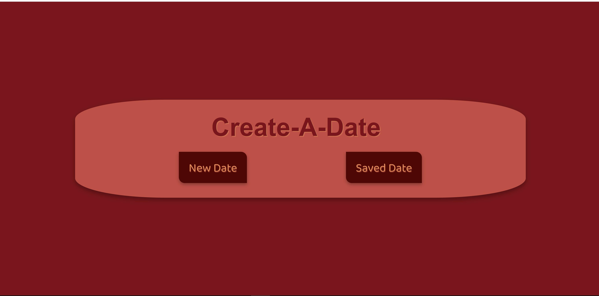
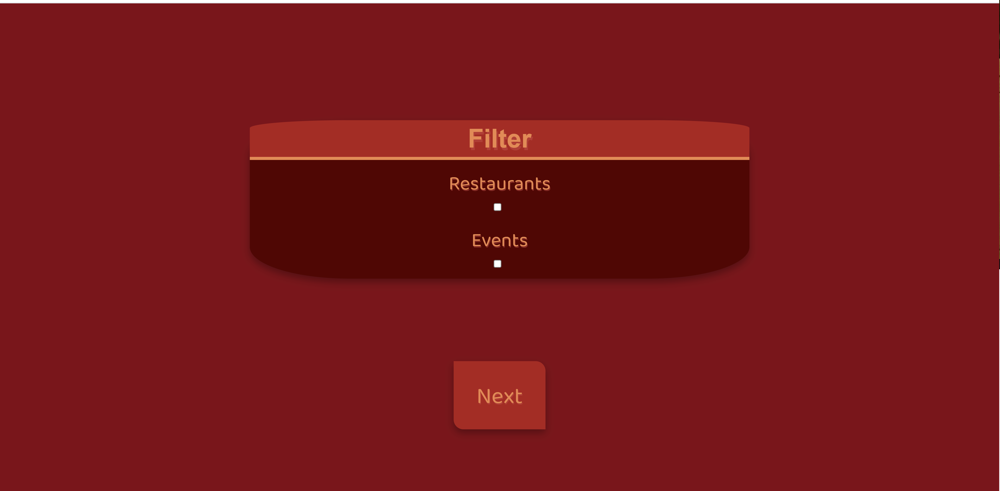
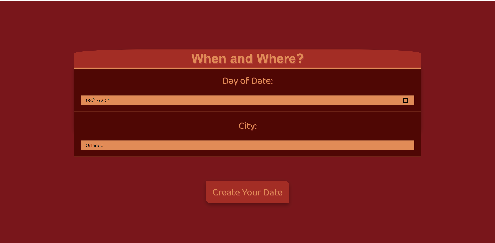
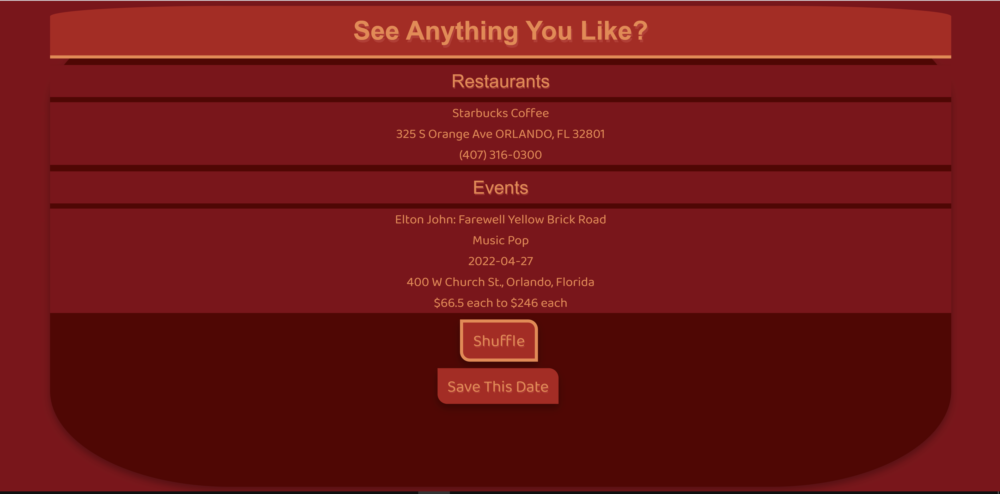
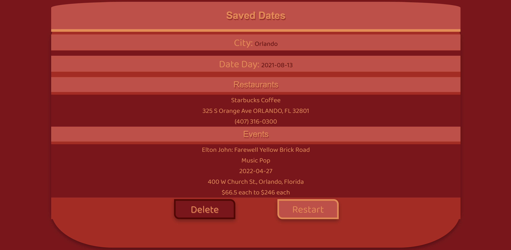

# Create-a-date

Are you tired of the conversation of "What do you wanna do today?" and "I don't know, you pick.". Well look no further! The app "Create-A-Date" was made for you, someone looking for ideas, to create a truly special day for you and another(or maybe just for you!). The way we have made this possible is by incorporating Yelp, TicketMaster, Fandango in order to help you create your perfect day. The way this works is you, the user, put in your criteria for the date and then press,"Create Your Date". Then, you have options you may look through and choose. Afterwards, when you're happy with your date, you can save it to look at later! 

### Built With
HTML
CSS
Foundation
JavaScript

### Website
https://electrolion.github.io/Create-a-date/

## Author
👤 **Michale Astalos**
👤 **Arianna Mccollum**
👤 **William Mackie**
👤 **Shannon Posey**
👤 **Ryan Dakin**
## 📝 License
Copyright © 2021